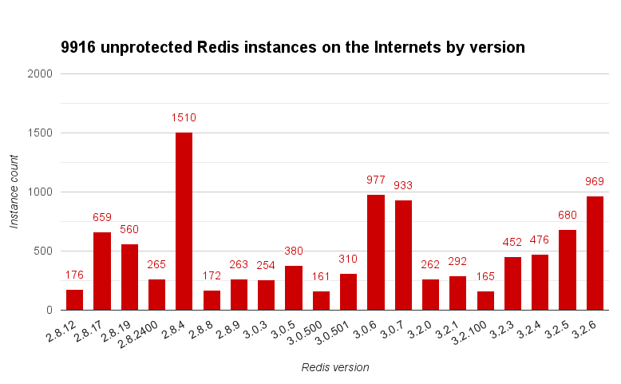
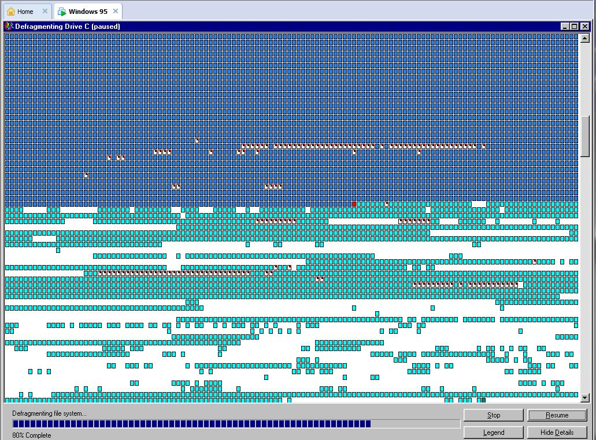

# Redis Watch Edition #66

> January, 2017

## # include "i.h"

Recent weeks have plagued us with reports about databases being hijacked for ransom by attackers. While this isn't really news - this has been going on for years now - there is indeed a scaling trend in the number and severity of attacks. I compiled this little chart from **[Shodan @shodanhq](https://twitter.com/shodanhq)** data - can someone please explain how come there are so many 3.2+ instances?!?

Cheers,
Itamar

## `int main(int argc, char **argv) {`

### [The first release candidate of Redis 4.0 is out](http://antirez.com/news/110) (6:37.9 minutes to read)

We getting near the GA of the next major Redis version, and major it is indeed. ~~Ken the Warrior~~ **[Salvatore Sanfilippo @antirez](https://twitter.com/antirez)** highlights some of what's in scope: replication v2, LFU cache eviction policy, non blocking `DEL` and `FLUSHALL`/`FLUSHDB`, mixed AOF-RDB format, the new `MEMORY` command and... MODULES! MODULES! MODULES!

### [Redis 3.2.7 is out: IMPORTANT SECURITY FIXES INSIDE](https://www.reddit.com/r/redis/comments/5r8wxn/redis_327_is_out_important_security_fixes_inside/) (2 minutes to read)

The current Redis version gets an update that every developer should get because it protects against a cross protocol vulnerability that can be used to attack your laptop from the browser - see [a proof of concept](http://bouk.co/blog/hacking-developers/) by **[Bouke vdBijl @BvdBijl](https://twitter.com/BvdBijl)** and [another one](http://whatsinmyredis.com/) by **[Mike Nolan @SxNolan](https://twitter.com/SxNolan)**.

### [The Results Are in – Redis Usage Survey 2016!](https://redislabs.com/blog/the-results-are-in-redis-usage-survey-2016) (2 minutes to read)

Have you ever wondered what other people are doing with Redis? Well, we have and our VP Product Marketing **[(((socialeena))) @leena_joshi2015](https://twitter.com/leena_joshi2015)** did a stupendous job in cajoling responses from the open source Redis community and Redis Labs' customers. 

### [An Overview of Redis Security](https://www.youtube.com/watch?v=Sz60WMWtHQQ) (43:59 minutes to watch)

**[Salvatore Sanfilippo @antirez](https://twitter.com/antirez)** in a session about Redis' view of security ("not our problem"), insecure default security settings that "just work" and the complete recipe for unleashing a fecal tornado. Watch this if you want to understand the underlying reasoning and future direction of security and Redis.

Note: audio a bit wonky, but bearable.

### [Pull Request #3720: Active memory defragmentation](https://github.com/antirez/redis/pull/3720) (no reading needed)

Most Redis users never need to concern themselves with memory fragmentation, but there are cases where it becomes and ugly and expensive fact. While fragmentation isn't a Redis-specific issue per se, the only way to defragment an instance's memory is to reboot it (ouch). Or rather, that was the case until this pull request by Redis  Labs' Oran Agra was merged. Going forward, the built-in defragmentor (disabled by default) can remake a whole out of the Swiss-cheese that your server's memory had become.

#### OH [antirez](https://news.ycombinator.com/item?id=13375067): I feel like that

### [Moving from Hazelcast to Redis](https://engineering.datorama.com/moving-from-hazelcast-to-redis-b90a0769d1cb#.3sr3aub33) (6 minutes to read)

**Udi Kidron** of **[@Datorama](https://twitter.com/Datorama)** tells about the migration of their centralized data store. The change, motivated by the desire to reduce operational overheads, was done gradually so the team was able to reduce risks and develop optimal solutions for each challenge they encountered. What I like best, however, is how the Redis community had helped, in this case the community being [Redisson](http://redisson.org)'s **[Nikita Koksharov](https://github.com/mrniko)** - well done :)

### [Moving persistent data out of Redis](http://githubengineering.com/moving-persistent-data-out-of-redis/) (6 minutes to read)

The story from **[GitHub Engineering @GitHunEng](https://twitter.com/GitHubEng)** by platform engineers **[Bryana Knight @bryanaknight](https://twitter.com/bryanaknight)** and **[Miguel Fernández @mikelodeon](https://twitter.com/mikelodeon)** is about moving in the opposite direction, in which data is taken out of Redis and into MySQL. Simplified operations are also quoted here as the motivating force in this case, but transition itself had been preceded by significant optimizations and infrastructural development.

The [comments at HackerNews](https://news.ycombinator.com/item?id=13367077) are also interesting.

### [First-Ever Redis Modules Hackathon](https://redislabs.com/blog/first-ever-redis-modules-hackathon) (5 minutes to read)

Give a man a fish and you'll feed him for a day; give a developer the Redis modules API (and the promise for fame and fortune) and you've got yourself a hackathon! With five winners and over 15 finalists, it was definitely a great experience :)

### [Learn redis the hard way (in production)](http://tech.trivago.com/2017/01/25/learn-redis-the-hard-way-in-production/) (10 minutes to read) `#PHP`

There are only a handful of experiences that are more rewarding and educational than solving real production issues. That experience, however, often entails turning your hair prematurely gray and responsible adults have been known to be reduced to slobbering babies by it. To reduce your personal risk and save your mane's natural RGB value, you'd be wise to heed the lessons learned over the course of more than 6 Redis production years at **[trivago Engineering @trivago_tech](https://twitter.com/trivago_tech)** as told by **[Andy Grunwald @andygrunwald](https://twitter.com/andygrunwald)**. 

#### **OH** _"Life is what happens to you while you're busy making other plans."_ **[John Lennon, Beautiful Boy](https://en.wikipedia.org/wiki/Beautiful_Boy_(Darling_Boy))** 

### [brandur/redis-cell](https://github.com/brandur/redis-cell) `#foss` `#C` `#RedisModules`

The winning entry of the aforementioned hackathon is a Redis module that provides rate limiter based on the generic cell rate algorithm. More from the module's author, **[Brandur @brandur](https://twitter.com/brandur)**, on the why, how & what in his guest post in our blog - **[redis-cell: a Rate Limiting Redis Module](https://redislabs.com/blog/redis-cell-rate-limiting-redis-module)**.

### [rwz/redis-gcra](https://github.com/rwz/redis-gcra) `#foss` `#Ruby`

Here's something you don't see every day - a Redis-backed rate limiting based on generic cell rate algorithm, as a Ruby gem, by **[Pavel Pravosud @rwz](https://twitter.com/rwz)**.

### [cossacklabs/rd_themis](https://github.com/cossacklabs/rd_themis) `#foss` `#C` `#RedisModules`

[Themis](https://www.cossacklabs.com/themis/) is a crypto engine from **[Cossack Labs @cossacklabs](https://twitter.com/cossacklabs)** that now has a Redis module. Read more in the [blog post](https://www.cossacklabs.com/themis-database-plugins.html).

### [RedisLabs/rmtest](https://github.com/RedisLabs/rmtest) `#foss` `#RedisModules` `#Python`

A package that makes it sooo easy to do Redis module unit tests - by **[Dvir Volk @dvirsky](https://twitter.com/dvirsky)**.

### [gryadka/GryadkaJS](https://github.com/gryadka/GryadkaJS) `#foss` `#JavaScript`

Gryadka is a minimalistic reliable master-master replicated consistent key/value layer on top of multiple instances of Redis. Using 2N+1 Redis instances Gryadka keeps working when up to N instances become unavailable.

Its core has less than 500 lines of code but provides full featured Paxos implementation supporting such advance features as cluster membership change (ability to add/remove nodes to a cluster) and distinguished proposer optimization (using one round trip to change a value instead of two).

All this awesomeness is brought to us by **[Denis Rystsov @rystsov](https://twitter.com/rystsov)**.

### [A Foreign Exchange Rate API](http://tech.marksblogg.com/airflow-postgres-redis-forex.html) (5 minutes to read) `#howto` `#Python`

An easy introduction to [Apache Airflow](https://github.com/apache/incubator-airflow) that handles caching (foreign exchange rate) data from PostgreSQL to Redis. Thanks to **[Mark Litwintschik @marklit82](https://twitter.com/marklit82)**.

### [Two simple ways to optimise Redis access in a PHP front-end application](https://theiconic.engineering/two-simple-ways-to-optimise-redis-access-in-a-php-front-end-application-d3d25c9b1333) (4 minutes to read) `#howto` `#PHP`

Ways being "request bundling" and "deferred updates" - solid advice from **[Andre Wyrwa @wyrfel](https://twitter.com/wyrfel)** via **[ICONIC Engineering @ICONICEng](https://twitter.com/ICONICEng)**.

### [Next Level Spring with Redis](https://www.youtube.com/watch?v=VvK-uLWDHFo) (29:50 minutes to watch) `#Java` `#Spring`

By **[Christoph Strobl @stroblchristoph](https://twitter.com/stroblchristoph)**

Slides: [http://www.slideshare.net/SpringCentral/next-level-redis-with-spring](http://www.slideshare.net/SpringCentral/next-level-redis-with-spring)

### [Caching Distributed Work Output in Redis with ASP.NET Core](https://medium.com/@KevinHoffman/caching-distributed-work-output-in-redis-with-asp-net-core-7d77695e6757) `#howto` `#ASPNetCore` `#Quine`

In which **[(((Kevin Hoffman))) @KevinHoffman](https://twitter.com/KevinHoffman)** shows how to.

### [ethanhann/Laravel-RedisStore](https://github.com/ethanhann/Laravel-RedisStore)  `#foss` `#PHP` `#Laravel`

Sweet and short - **[Ethan Hann @EthanHann](https://twitter.com/EthanHann)**'s replacement for Laravel's RedisStore compresses your strings.

#### **OH** **[Kevin O'Connor @gooeyblob](https://twitter.com/gooeyblob/status/822090116134907904)** > _@antirez want to make sure you saw this, reddit is not anti-redis! :) [https://news.ycombinator.com/item?id=13429314#13433946](https://news.ycombinator.com/item?id=13429314#13433946)_

### [Grab your hardhat!](https://medium.com/@stockholmux/grab-your-hardhat-b639d4f7fe07) (7 min read) `#howto` `#NodeJS` `#Angular`

**[Kyle @stockholmux](https://twitter.com/stockholmux)** shows how to build a data streaming application using his favorite tools of the trade.

#### **OH**  _["Redis is a core architecture](https://www.redfin.com/blog/2017/01/2016-a-redfin-engineering-year-in-review.html):  Before 2016, Redfin did not have a built-in caching strategy. Now, we have Redis, which is behind some of the huge performance gains we’ve seen on the map and listing details page this year.”_ by **[Bridget Frey @SVBridget](https://twitter.com/SVBridget)** via **[Redfin @Redfin](https://twitter.com/Redfin)**

### [Communicating Go Applications through Redis Pub/Sub Messaging Paradigm](https://medium.com/@mcetin.cm/communicating-go-applications-through-redis-pub-sub-messaging-paradigm-df7317897b13) (6 minutes to read) `#Go` `#howto`

An overview and implementation of the above by **[M. Cetin @manorie_](https://twitter.com/manorie_)**.

### [Redis, STunnel, and C#](http://hyeomans.com/Redis-STunnel-CSharp/) `#CSharp` `#howto`

Every time you go online searching for the solution to your problem, you can make the world a better place if you write up your findings. That is exactly what **[Hector Yeomans @h_yeomans](https://twitter.com/h_yeomans)** did after surviving his own battle of wits against security certificates and silent exceptions.

### [Chaos Testing Your Exception Handling in Redis](https://blog.appliedis.com/2017/01/31/chaos-testing-your-exception-handling/) `#foss` `#Windows` (3 minutes to read)

Chaos testing is a great way to make sure that you're ready for that horrible moment when everything goes to hell in production. This useful idea is implemented by **[Vishwas Lele @vlele](https://twitter.com/vlele)** at **[AIS @aisteam](https://twitter.com/aisteam)** in a fork off the Windows fork of Redis.

#### **OH** **[Orane Edwards @oraneedwards8](https://twitter.com/oraneedwards8/status/822335159156568067)** > _Adding #redis to my stack is probably the best decision I've made in life._

## `}`

## The Future

### [Docker & Redis - on Azure! (Azure Israel meetup)](https://www.meetup.com/AzureIsrael/events/235774776/)

**When:** Tuesday, February 7, 2017, 5:00 PM to 7:30 PM
**Where:** 30 Ibn Gabirol St., 3rd Floor, Tel Aviv-Yafo
**What 1:** Containers, Docker, Swarm & Kubernetes
**What 2:** Azure Redis Cache
**Organizer:** **[Eran Stiller @eranstiller](https://twitter.com/eranstiller)** via **[Microsoft Azure @Azure](https://twitter.com/Azure)**

### [Introducing Redis modules (Redis London meetup)](https://www.meetup.com/Redis-London/events/237068065)

**When:** February, 2017 - to be announced
**Where:** London - please contact me or the organizers if you can help with a venue
**What:** Modules, modules, modules & modules
**Organizers:** **[Baris Balic @BarisBalic](https://twitter.com/BarisBalic)**, **[Anish Mohammed @anishmohammed](https://twitter.com/anishmohammed)**, **[Harry Marr @harrymarr](https://twitter.com/harrymarr)** & **[Richard Cox](mailto:richard.cox@redislabs.com)**

## Redis Labs

### [Redis Day TLV 2017](https://redisdaytlv2017.eventbrite.com)

**When:** February 14, 2017, 10:00 AM to 5:00 PM
**Where:** Talkhouse, Hangar 12, The Tel Aviv Port

Redis Day a gathering for everyone interested in the fastest open source in-memory database. Join the community of Redis users and developers to hear their stories and learn about what's new. The agenda includes:

* Keynote by **[Salvatore Sanfilippo @antirez](https://twitter.com)**, Redis creator and lead dev
* Use case stories from Redis users, including: **[VideoCites](http://www.videocites.com/)**, **[Stratoscale @Stratoscale](https://twitter.com/Stratoscale)**, **[Dynamic Yield @DynamicYield](https://twitter.com/DynamicYield)**, **[WE ARE TV @WeAreTv](https://twitter.com/WeAreTv)** and more!
* Redis developers tell about their stuff, including: **[Dvir Volk @dvirsky](https://twitter.com/dvirsky)**, **[Roi Lipman @roilipman](https://twitter.com/roilipman)**, **[Itamar Haber @itamarhaber](https://twitter.com/itamarhaber)** and others!

### [RedisConf 2017](http://redisconference.com/)

**When:** May 31 to June 2, 2017
**Where:** Marriott Marquis, San Francisco

Call for papers and registration is now open - submit your talk and reserve your place at the Redis event of the year!

### [RLEC 4.4 Release](https://redislabs.com/blog/rlec-4-4-release)

Users of Redis Labs Enterprise Cluster rejoice - much awesomeness is wrapped into our latest release, including: Redis v3.2, multiple active proxies, Flash/SSD support (preview 2), role-based administration, 🐟-able consistency and a whole lot of internal optimizations and removals of undocumented features. 

### [Careers at Redis Labs](https://redislabs.com/company/redis-labs-careers)

Our Mountain View and Tel Aviv offices have a multitude of open positions, including: developers & hackers, solution and support engineers, sales and marketing - apply today (and say that I sent you ;))
