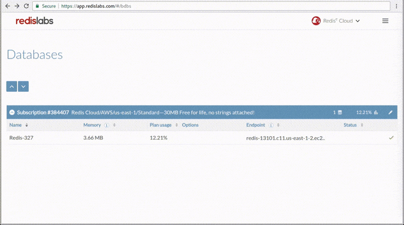

# Redis Watch Edition #67

> February, 2017

## `# include "i.h"`

Firstly and foremostly, Happy 8th birthday Redis!

Secondly, despite its low cardinality, February was packed with Redis news (see cherry pickings below). It was even more interesting than usual because of Salvatore's visit to our Tel Aviv offices: the perfect excuse to party, but also a chance for the entire team to sit together and do some serious thinking. The throughput of wetware, much like that of hardware, benefits greatly from the reduced latency that results from colocation :)

Oh, and I had a [moment](https://twitter.com/i/moments/827336773118414848).

Cheers,
Chuck Norris

## `int main(int argc, char **argv) {`

### [Redis 3.2.8 is out!](https://raw.githubusercontent.com/antirez/redis/3.2/00-RELEASENOTES) (1 minutes to read)

A **CRITICAL** update which temporarily reverts the recent upgrade the jemalloc's v4 due to a potential deadlock issue.

*Trivia bit: this is the first release ever to be published from Tel Aviv :)*

### OH [Salvatore Sanfilippo @antirez](https://twitter.com/antirez/status/830871321961709569)

> Having a good time here in Tel Aviv with the Redis Labs folks, many interesting discussions about Redis 4.2 and other stuff.

### OH [Chris Baglieri @chrisbaglieri](https://twitter.com/chrisbaglieri/status/832304098103926784)

> Redis continues to be my favorite piece of software. Years and years of hammering and pushing on it, always impressed. Thank you @antirez.

### [Redis 4.2 roadmap : redis](https://www.reddit.com/r/redis/comments/5srnh9/redis_42_roadmap/) (< 1 minute to read)

Once v4.0 is released, here's what **[Salvatore Sanfilippo @antirez](https://twitter.com/antirez)** has planned next. The gist of things: better cluster, better modules API and a [Disque](https://github.com/antirez/disque)-as-a-module implementation (!), a [Stream data structure](https://github.com/redis/redis-rcp/blob/master/RCP11.md) and a complete overhaul - the [Listpack](https://gist.github.com/antirez/66ffab20190ece8a7485bd9accfbc175) - of the internal ziplist data structure.

### OH [NoSQL Trump @realNoSQLTrump](https://twitter.com/realNoSQLTrump/status/829255679756161025)

> "Better Multi-DC story" - AMERICA needs only one DC, that's the story. Shame! #draintheswamp

### [Redis Day TLV 2017 w/ <3: Session videos and slides](https://redislabs.com/videos/redisday-tlv-2017/) (13 sessions)

Last month, Redis geeks and geekettes got the perfect Valentine's gift: a day packed with sessions about everyone's favorite in-memory database. The event turned out to be a huge success with over 200 attendees showing up and staying all the way until `SHUTDOWN`. You can find photos from the day in the [Twitter moment](https://twitter.com/i/moments/831606477961961474) and in [this folder](https://drive.google.com/open?id=0B79TLsuJUpU4VnNUVV9VVW94U3c).

### [Redis on the Raspberry Pi: adventures in unaligned lands](http://antirez.com/news/111) (0x0017 minutes to read)

One of the nicest things about Redis is that you find it practically everywhere (not unlike Chuck Norris). Another things you find everywhere are the internets, hence the IoT. Marrying the two makes a lot of sense (even if I don't), so now (as in 4.0) not only can you run Redis on some of these critters, you can actually wring out impressive performance. A little further down along the road, *"this will be even more interesting when the stream data structure will be available in Redis 4.2."*

### [Ice wine, Redis and Microcontrollers](https://medium.com/@stockholmux/ice-wine-redis-and-microcontrollers-96f90be09ea) (17 min read)

As if to complement the above (but I know for a fact that this has been in the making before), **[Kyle @stockholmux](https://twitter.com/stockholmux)** implemented a Redis client on the ESP8266 Microcontroller for the sole and sacred purpose of keeping his wine properly chilled. Cool :)

### OH [John Jansen @dreamware](https://twitter.com/dreamware/status/829873865824219140)

> redis is like the pair of front cutting pliers in my toolbox, surprisingly frequently used … more so than my hammer or screwdrivers even

If Redis was a machete, I'd be [Jason Voorhees](https://en.wikipedia.org/wiki/Jason_Voorhees)

### [sripathikrishnan/redis-rdb-tools 0.1.9](https://github.com/sripathikrishnan/redis-rdb-tools/releases/tag/rdbtools-0.1.9) `#foss` `#Python`

The development of this invaluable utility has been all but abandoned until recently. While plans are to have this sort of functionality wrapped into Redis proper in all eventuality, we can until then resort to the updated package that includes:

- [x] Support for Python 3
- [x] Support for the newer RDB format (v8)
- [x] Multiple fixes and other goodies

### [danni-m/redis-tsdb](https://github.com/danni-m/redis-tsdb) `#foss` `#C` `#RedisModule` `#devops`

This one is gonna be a hit: a time series database that already integrates with StatsD and Grafana. By friend and colleague **[Spaghetti Monster @dannidevmo](https://twitter.com/dannidevmo)**.

### [In search of a simple consensus algorithm](http://rystsov.info/2017/02/15/simple-consensus.html) (I simply can't agree with myself on how much time it takes to read it)

Here's an overview and demonstration from **[Denis Rystsov @rystsov](https://twitter.com/rystsov)**, author of yesteredition's [GryadkaJS](RW-66.md#gryadkagryadkajs-foss-javascript), about how Single Decree Paxos is simpler than Multi-Paxos and Raft.

### OH [Reid McKenzie @arrdem](https://twitter.com/arrdem/status/831663269228064769)

> You come to me
> in your time of need
> with redis code
> checking keys for change
> and #FIXME: race condition
> and yet
> you have not used locks

### [Redis Pub/Sub under the hood](https://making.pusher.com/redis-pubsub-under-the-hood/) (about 11 minutes to read + tons of rabbit holes)

Any self-respecting nerd knows there's nothing is more exciting than a peek under the hood. This golden nugget from **[James Fisher @MrJamesFisher](https://twitter.com/MrJamesFisher)** of **[Pusher @pusher](https://twitter.com/pusher)** (congrats for the inaugural post, looking forward to its next parts!) is sure to scratch that itch, with a delightfully detailed deep dive into Redis' Pub/Sub internals.

### [Redis Caching in the Google Cloud Platform](https://blog.falafel.com/redis-caching-in-the-google-cloud-platform) `#howto` `#RaaS` `#GCP`

If you ever needed a tutorial on how to get your Redis mojo going on **[Google Cloud @googlecloud](https://twitter.com/googlecloud)**, this one by **[Jason Follas @jfollas](https://twitter.com/jfollas)** should get you sorted. Via **[Falafel Software Inc @falafelsoftware](https://twitter.com/falafelsoftware)**.

### [Building a Microservices Example Game with Distributed Messaging](https://community.risingstack.com/building-a-microservices-example-game-with-distributed-messaging/) (13 min) `#NodeJS` `#HotPotato` `#howto`

**[Carlos Justiniano @cjus](https://twitter.com/cjus)** teaches by example, showing microservices are put together to create a game with distributed messaging. To do that he's using [Hydra](https://github.com/flywheelsports/fwsp-hydra), a NodeJS light-weight library for building distributed computing applications, and the Super Glue of Microservices: Redis. Via **[RisingStack @RisingStack](https://twitter.com/RisingStack)**.

### [Working With Sorted Sets in Redis](https://lornajane.net/posts/2017/working-with-sorted-sets-in-redis) (4 minutes to read)

A light introduction to Sorted Sets and some of their uses from **[Lorna Mitchell @lornajane](https://twitter.com/lornajane)**, who own admission:

> I work with a bunch of datastores and I probably shouldn't have favourites - but if I did, Redis would be one of them!"

### [Solving Our Slow Query Problem](http://www.scalingsaas.com/posts/solving-our-slow-query-problem/) (7 minutes to read)

The need to scale is a mixed blessing - on the one hand you're doing so good that you're growing, but on the other hand supporting that growth means more work. The database tier is traditionally an especially hairy scaling challenge, and one way to tackle it is to think outside the box - instead of making your database faster/bigger/better, offload some of the work to a nimbler solution. Which is exactly what **[Derrick Reimer @derrickreimer](https://twitter.com/derrickreimer)** of **[Drip @getdrip](https://twitter.com/getdrip)** did by live caching his Postgres database:

> The sorted and unsorted set data types are the killer features that made us choose Redis

### [Caching Is Not Like Bacon: Control Yourself](https://sendgrid.com/blog/caching-is-not-like-bacon-you-need-to-control-yourself/) (8 minutes to read because there's math in it)

To offset the previous item, here's one from **[Brad Culberson @bculberson](https://twitter.com/bculberson)** who wisely advocates restraint before rushing to caching. Put differently, don't sell the plow to buy the mule.

### [aclisp/hiredispool](https://github.com/aclisp/hiredispool) `#C` `#foss`

Should be very useful - provides connection pooling and auto-reconnect for classic hiredis client.

### [Feeding Frenzy with SimpleFeed](http://kig.re/2017/02/19/feeding-frenzy-with-simple-feed-activity-feed-ruby-gem.html) `#howto` `#Ruby`

Neato - implement an activity feed in 15 minutes or less by **[Konstantin (kig) @kig](https://twitter.com/kig)**.

### [Perl and Redis](http://blog.builtinperl.com/post/perl-and-redis) (2 minutes to read)

This is nice, despite the WWII imagery - the recounting of a first impression from a Redis n00b. Via **[BuiltinPerl @BuiltinPerl](https://twitter.com/BuiltinPerl)**.

### OH [Carl Zulauf @existensil](https://twitter.com/existensil/status/833926341225435136)

> Seems to get a lot of hate, but systemd has totally made my life easier. It's not Redis good, but it's still good software :-)

That's a good one.

### [Redis Cluster with Passwords](https://trodzen.wordpress.com/2017/02/09/redis-cluster-with-passwords/) `#howto`

Here is what appears to be a hack-tension for making Redis OSS cluster work with password authentication. Try at your own risk.

### [Containers & Redis – Running Redis on Windows with Docker](https://blogs.msdn.microsoft.com/uk_faculty_connection/2017/02/21/containers-redis-running-redis-on-windows-with-docker/) `#howto` `#docker` `#windows`

For developers on Windows who want a local taste of the real thing. By **[Jingya Wang @JWT0T](https://twitter.com/JWT0T)**.

### OH [Ankush Sharma @Ankush1092](https://twitter.com/Ankush1092/status/833278692512010241)

> @antirez What comes to mind when I'm working with Redis. Thank you so much for such a great tool.
>
> 

Ohm.

### OH [Helpful Floof Wizard @mcantor](https://twitter.com/mcantor/status/835915580993568770)

> I'm so pissed that everyone sold Redis et al. as "no SQL" and not "fucking awesome completely different way of thinking about persistence"

Word.

## `}`

## The Future

### [Redis Modules and Scalability challenges (Seattle Redis Meetup)](https://www.meetup.com/Seattle-Redis/events/237888021/)

**When:** Wednesday, March 22, 2017, 5:30 PM to 7:30 PM
**Where:** **[Napster @napster](https://twitter.com/napster)**, 701 5th Avenue, Suite 3100, Seattle, WA
**What 1:** Using Redis and RediSearch module to store and search volatile data by **[dmitrypol @dmitrypol](https://twitter.com/dmitrypol)**
**What 2:** Too Big To Failover by **[Aaron Pollack @the_lolpack](https://twitter.com/the_lolpack)**
**Organizers:** **[Tague Griffith @tague](https://twitter.com/tague)**, **[dmitrypol @dmitrypol](https://twitter.com/dmitrypol)** and **[Walé Ogundipé @kopasetik](https://twitter.com/kopasetik)**

### [RedisConf 2017: Call for Papers & Registration](http://redisconference.com/)

**When:** May 31 to June 2, 2017
**Where:** Marriott Marquis, San Francisco

Call for papers and registration is now open - submit your talk and reserve your place at the Redis event of the year!

## Redis Labs

### [On in-memory, key-value data stores](http://www.odbms.org/blog/2017/02/on-in-memory-key-value-data-stores-ofer-bengal-and-yiftach-shoolman/) (7 minutes to read)

Prof. Roberto V. Zicari of **[odbms.org @odbmsorg](https://twitter.com/odbmsorg)** interviews Redis Labs' founders, CEO **[Ofer Bengal @OferBengal](https://twitter.com/OferBengal)** and CTO **[Yiftach Shoolman @Yiftachsh](https://twitter.com/Yiftachsh)**, on the database market's evolution, open source software,  the cloud and Redis.

### [Unveiling the New Redis Enterprise Cloud UI | Redis Labs](https://redislabs.com/blog/unveiling-new-redis-enterprise-cloud-ui/) (2 minutes to read, 11:56 to watch)

**[Aviad Abutbul @AviadAb](https://twitter.com/AviadAb)** presents the new interface of our Redis-as-a-Service (RaaS) service, Redise Cloud.

### [Webinar: Real Time Fraud Analytics](https://www.youtube.com/watch?v=wlTdY780zp0) (40:13 minutes to watch)

**[Ravi Sandepudi @sandepudi](https://twitter.com/sandepudi)** of **[Smility @SimilityCom](https://twitter.com/SimilityCom)** explains how Redis is used in detecting fraudulent behavior in real time.
