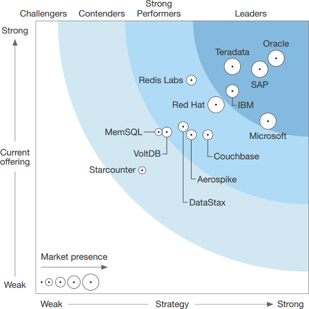

# Redis Watch Edition #68

> March, 2017

## `# include "i.h"`

Hello,

First and foremost I'd like to welcome our newest subscribers who have joined from Redis Weekly - if you do not wish to receive Redis Watch in the future, please unsubscribe using the link at the bottom. I also want to thank François-Guillaume Ribreau for his amazing years-long contributions to the community, and wish him only the best in all his future endeavors.

### OH [François-G. Ribreau @FGRibreau](https://twitter.com/FGRibreau/status/848932676572762112)

> After 4 years, 184 issues, thousands of subscribers, @RedisWeekly is merged into RedisWatch! [http://us7.campaign-archive1.com/?u=9d976d2d2f980dfd645881aea&id=cd6ad93f42](http://us7.campaign-archive1.com/?u=9d976d2d2f980dfd645881aea&id=cd6ad93f42)

Secondly, I've been working hard experimenting with [scaling (the ASCII logo of) Redis](https://gist.github.com/itamarhaber/7d40e0f29dba633b5a8a6183abc384c0) - lmk what you think.

And lastly, I always said that Redis is like a drug: easy to get hooked, makes the world a better place, but (RAM) can become expensive. Hence, the following is hardly surprising.

### OH [Erik Westlund @erikdbwestlund](https://twitter.com/erikdbwestlund/status/840663153331564544)

> Closed captioning on @HBO's #TheWire. I love #redis but didn't know it was a street name for heroin.

Cheers,
Itamar

## `int main(int argc, char **argv) {`

### [Redis on ARM](https://redis.io/topics/ARM) (3 minutes to read)

With Redis aligned to run on ARM devices, **[Salvatore Sanfilippo @antirez](https://twitter.com/antirez)** had added a new documentation page at [redis.io](https://redis.io) that includes relevant notes and some performance figures (hey, why no #PiZero?!?)

### [Stack Overflow Developer Survey 2017](http://stackoverflow.com/insights/survey/2017/#technology-most-loved-dreaded-and-wanted-databases) (54 minutes to read thoroughly)

tl;dr Redis is the most-loved database by the community ;) via the awesome team of **[Stack Overflow @StackOverflow](https://twitter.com/StackOverflow)**

### [The latest round of Google Open Source Peer Bonus winners](https://opensource.googleblog.com/2017/03/the-latest-round-of-google-open-source.html) (<1 minute to skim)

**[Summer of Code @gsoc](https://twitter.com/gsoc)** acknowledges 52 additional exceptional OSS developers, of which I know at least one.

### [Defining Moments in Database History](https://www.xaprb.com/blog/defining-moments-in-database-history/) (6 minutes to read)

A timeless piece from **[Baron Schwartz @xaprb](https://twitter.com/xaprb)**, who saw it all coming and continues prophesying.

### [Bash completion for redis server and cli](https://gist.github.com/dvirsky/99619d59ea836bb8ce6a4329e697094b) `#foss` `#bash` `#kewl`

Between this and that, señor **[Dvir Volk @dvirsky](https://twitter.com/dvirsky)** put together a thingamajig that adds command-line TAB-completion to `redis-server` and `redis-cli` in bash. To use, just save and `source` the gisted script from your `.profile` file.

### [A table of the shortest possible alphanumeric string that is mapped by redis' crc16 to any given cluster slot](https://gist.github.com/dvirsky/93f43277317f629bb06e858946416f7e) `#foss` `#C`

Another useful gist from **[Dvir Volk @dvirsky](https://twitter.com/dvirsky)** that should be come in handy for anyone who wants to develop her/his own code that shards into hash slots like Redis Cluster does. The author had used advanced techniques to generate this and promises the sequences are the shortest possible, making it ideal for embedding in with minimal stack overhead.

### [More fun than Clash of Clans - Redis on Android](https://twitter.com/itamarhaber/status/839201246288424962) `#foss` `#android` `#uberkewl`

If you're lucky enough to have an Android phone, **[David Martínez @vaites](https://twitter.com/vaites)** and **[Termux @termux](https://twitter.com/termux)** just made it possible to run Redis on it (although this does not leverage the new support for ARM). Is that a Redis in your pocket or are you just happy to see me?

1. Get [Termux](https://termux.com/) from [Google Play](https://play.google.com/store/apps/details?id=com.termux) or [F-Droid](https://f-droid.org/repository/browse/?fdid=com.termux), and launch it
2. Install Redis: `packages install redis`
3. Run the server: `redis-server`

### [Scaling your API with rate limiters](https://stripe.com/blog/rate-limiters) (8 minutes to read)

**[Stripe @stripe](https://twitter.com/stripe)**'s **[Paul Tarjan @ptarjan](https://twitter.com/ptarjan)** provides the context, rational and use cases for different API rate limiters. [Production source code](https://gist.github.com/ptarjan/e38f45f2dfe601419ca3af937fff574d) is included.

### [An Afternoon of Code Golf (in Lua) to Achieve 4x performance in Redis](https://amplitude.engineering/an-afternoon-of-code-golf-in-lua-to-achieve-4x-performance-in-redis-cd631268f25) (6 min read)

A tale by **[Kurt Norwood @kortox](https://twitter.com/kortox)** of **[Amplitude @amplitudemobile](https://twitter.com/amplitudemobile)** that shows the power of server-side scripting with Lua, cutting latency and improving concurrency. The thing to remember is that even if your Redis topology is different than Kurt's, Lua is still the best way to go for composing commands and reducing the number of network round trips.

### OH [Christopher Najewicz @tehsuck](https://twitter.com/tehsuck/status/839452737020514304)

> Once it's bootstrapped, redis / sentinel is magical for m/s replication and HA. #devops

### [Redis NFL Leaderboard](http://dmitrypol.github.io/redis/2017/03/05/redis-leaderboard.html) `#howto` `#Ruby` `#Mongoid`

Don't let the title fool you. Yes, everybody probably knows that Redis' Sorted Sets are the natural choice for leaderboards, but in this article author **[dmitrypol @dmitrypol](https://twitter.com/dmitrypol)** includes an extra clever trick: using Mongoid for the mapping.

### OH [Kris Walker @kixxauth](https://twitter.com/kixxauth/status/838491680064094213)

> Data structures are thrilling.I'm seeing of merit of using Redis as a primary, transactional database.

### [Real-time Deduping At Scale](http://eng.tapjoy.com/blog-list/real-time-deduping-at-scale) (8 minutes to read)

Doing analytics on 2 million messages per minute is, to say the least, challenging. Once you choose at-least-once message delivery semantics, like the **[Tapjoy Engineering @TapjoyEng](https://twitter.com/TapjoyEng)** team have, detecting and discarding duplicate message can become a real pita of their Kafka-Spark-Postgres pipeline.

Enter Redis and **[ ♥ Aaron Pfeifer @obrie](https://twitter.com/obrie)**'s recounting of how it is used to dedupe transactions. To save on RAM overhead, Hashes are used as containers. To increase performance, Lua is employed to bring the CPU to the data. 

*Note: I'm somewhat ambivalent WRT the team's approach to scaling - application-side sharding is so 2013 ;) But then again, that really depends on your Redis deployment and Redis-as-a-Service provider ;)*

### [Want unlimited scale and performance? This is where to start](https://indexoutofrange.com/Want-unlimited-scale-and-performanceThis-is-where-to-start/) (5 minutes to read)

**[Szymon Warda @maklipsa](https://twitter.com/maklipsa)** reviews the foundations of key-value databases, and compares the prominent features between a few: Memcached, Riak and Redis.

### OH [tampe125 @tampe125](https://twitter.com/tampe125/status/841055947531403266)

> I'm officially in love with #redis

### [Configuring Redis Session State In ASP.NET Core](http://www.c-sharpcorner.com/article/configuring-redis-session-state-in-asp-net-core/) `#howto` `#ASPNETCore` `#CSharp`

Title says it all, but this is still a source of confusion for many so hopefully this will help. Via **[C# Corner @CsharpCorner](https://twitter.com/CsharpCorner)**.

### [A Guide to Redis with Redisson](http://www.baeldung.com/redis-redisson) `#howto` `#Java`

**[Eugen (Baeldung) @baeldung](https://twitter.com/baeldung)** writes Java tutorials. After having already covered using [Spring Data](http://www.baeldung.com/spring-data-redis-tutorial) and [Jedis](http://www.baeldung.com/jedis-java-redis-client-library), here's one about Redisson.

*Note: IMO the next article that Eugen needs to produce is about **[LettuceDriver @LettuceDriver](https://twitter.com/LettuceDriver)**, which BTW had recently graduated to being a top-level project - congrats **[Mark Paluch @mp911de](https://twitter.com/mp911de)** and **[Pivotal @pivotal](https://twitter.com/pivotal)**!*

### [Redis as a Shared Data Store Between Rails Apps](http://www.thegreatcodeadventure.com/redis-as-a-shared-data-store-between-rails-apps/) `#howto` `#Rails`

**[Sophie DeBenedetto @sm_debenedetto](https://twitter.com/sm_debenedetto)** teaches how to use Redis (the "Swiss Army knife of Databases", anonymous) as a shared data store between applications.

### [Node, Redis, and You!](https://vimeo.com/210005403) (32:13 minutes to watch) `#microservices`

**[Thomas Hunter II @tlhunter](https://twitter.com/tlhunter)** writes a book on Microservices, and talks about building them with Node and Redis (the "Super Glue of Microservices", I.H).

Slides: [https://thomashunter.name/presentations/node-redis-v1/](https://thomashunter.name/presentations/node-redis-v1/)

### [Applying Lambda Architecture on Azure](https://www.codeproject.com/Articles/1171443/Applying-Lambda-Architecture-on-Azure) `#howto` 

Even if you'll end up writing your own code and deploying it on a different cloud this is, at the very least, a nice overview of Lambda architecture's principles. Redis in the Speed layer is the natural choice (and this isn't another drug reference) - via **[CodeProject @codeproject](https://twitter.com/codeproject)**.

### OH [gelin yan @mathgl](https://twitter.com/mathgl/status/837557420998025217)

>  have used redis as ipc for years. It is easy to use, maintain and has plenty of drivers.

### [Displaying My Garage Door Status with Losant](https://www.hackster.io/rorpage/displaying-my-garage-door-status-with-losant-80a984) `#howto` `#IoT`

While technically involving an ARM device, this hack from **[Robbie Page @rorpage](https://twitter.com/rorpage)** is developed using **[Losant @LosantHQ](https://twitter.com/LosantHQ)**'s platform with Redise Cloud storing the current status of the door.

### [Point to Point Data Streaming (Audio / Video / Whatever)](http://scottlobdell.me/2017/03/point-point-data-streaming-audio-video-whatever/) `#howto` `#IoT`

**[Scott Lobdell @slobdell3](https://twitter.com/slobdell3)** uses Redis as an "intermediary buffer" for streaming the baby-monitor's video of his good son (does he have other kinds?) in the home front.

### [Keeping your Redis in shape in 3 simple steps](https://blog.solutotlv.com/keep-redis-shape-3-simple-steps/) `#howto`

**[Omer Levi Hevroni @omerlh](https://twitter.com/omerlh)** from **[Soluto Engineering @SolutoEng](https://twitter.com/SolutoEng)** is using Redis from my favorite Redis-as-a-Service provider for many purposes, but he has a feature request that we've yet to provide: emailing multiple recipients when a subscription's resources are about to be exhausted. I've already notified our PM team, but until we roll out this feature and for any other monitoring needs that you may have here or anywhere else have, Omri was kind enough (after gentle prodding ;)) to share his solution that uses [webdis](http://webd.is/) and a **[Nagios @nagiosinc](https://twitter.com/nagiosinc)**/**[Icinga @icinga](https://twitter.com/icinga)** plugin that [he wrote](https://github.com/Soluto/check-redis-plugin).

### OH [Taylor Weibley @themcgruff](https://twitter.com/themcgruff/status/844544191812259840)

> @antirez's redis continues to be the shining star in all the pieces of our stack. Awesome feature of the day is "notify-keyspace-events".

### [Redis and Cache Pre-Generation](http://dmitrypol.github.io/redis/2017/03/27/redis-cache-pregen.html) `#howto` `#Rails`

Another guide from the same **[dmitrypol @dmitrypol](https://twitter.com/dmitrypol)**, in which he reviews two use cases that implement preemptive caching.

### [A Key Expired In Redis, You Won't Believe What Happened Next](http://engineering.grab.com/a-key-expired-in-redis-you-wont-believe-what-happened-next) (11 minutes to read)

**[Grab Engineering @grabengineering](https://twitter.com/grabengineering)** tell how they tracked down an unexpected behavior concerning cached unicorns, key expiration and the use of slaves... but as noted in the comments by the creator, this was first reported by YouPorn years ago (albeit minus the unicorns one should hope). That said, it is still an important lesson learn, so make sure you read it all the way through (including the footnotes, and especially the 1st one).

### OH [Matthew Martin @mistersql](https://twitter.com/mistersql/status/845291846213554176)

> definition of insanity is making 30 day backups of Redis when all keys have EXPIRES far smaller than 30 days.

<-- not according to the DSM-V's definitions, but it certainly is wasteful in terms of storage and recovery time `#protip`

## Modules! Modules! Modules!

### [f0rmiga/sessiongate](https://github.com/f0rmiga/sessiongate) `#foss` `#CPP`
A simple and useful module for managing sessions by **[Thulio Ferraz Assis @thulioassis](https://twitter.com/thulioassis)** who's migrating it from C++ to C and rewriting it to use the low-level modules API, but [enjoying it](https://twitter.com/thulioassis/status/842525057490464768).

### [Webinar: Implementing Real time Machine Learning with Redis ML and Apache Spark](https://www.youtube.com/watch?v=rsMVGcRZGsg) (34:20 minutes to watch)
My colleague **[Shay Nativ @shaynativ](https://twitter.com/shaynativ)** gave this webinar, showing how to build a recommender engine using Apache Spark and [Redis-ML](https://github.com/RedisLabsModules/redis-ml). Very cool stuff.

Notebook: [http://bit.ly/sparkredisml](http://bit.ly/sparkredisml)

### [Redis as a JSON store](https://redislabs.com/blog/redis-as-a-json-store/) (6 minutes to read)
My blog post about ReJSON was finally published, and also got nice traction on the interwebs :) tl;dr it is a a Redis module that provides native JSON capabilities.

HN discussion: [https://news.ycombinator.com/item?id=13929258](https://news.ycombinator.com/item?id=13929258)

### [evanhuang8/iorejson](https://github.com/evanhuang8/iorejson) `#foss` `#NodeJS`
The first community-contributed "client" for ReJSON wraps ioredis for easy use in Node.JS - thank you Evan for this wonderful gift!

### [RedisLabsModules/RediSearch 0.11.1](https://github.com/RedisLabsModules/RediSearch/releases/tag/v0.11.1) `#foss` `#C` `#TextSearch`
**[Dvir Volk @dvirsky](https://twitter.com/dvirsky)** is diligently adding features, optimizing, crashing bugs and delighting users with RediSearch. Over the last months this module has have had several releases, the latest of which is above. Partial aggregative changes log:

- Has its own extensions!
- Much faster!
- Numeric query filters
- New advanced query filters: `INKEYS`, `INORDER` &amp; `SLOP`
- Supports updating documents
- Document payload storage
- Geo search
- Unicode aware case-folding in auto-complete searches

### [ethanhann/redisearch-php](https://github.com/ethanhann/redisearch-php) `#foss` `#PHP`
The first community-contributed client for RediSearch was made by **[Ethan Hann @EthanHann](https://twitter.com/EthanHann)** and comes with [impressive documentation](http://www.ethanhann.com/redisearch-php) - kudos!

### [tidwall/redbench](https://github.com/tidwall/redbench) `#foss` `#golang`
**[Josh Baker @tidwall](https://twitter.com/tidwall)**'s latest addition to his database's (Tile38) tools arsenal is a benchmarking package in Go, that also happens to work for custom Redis commands and modules.

## The Future

### [Redis Conf 2017](http://redisconf.com)

When: May 30 - June 1, 2017  
Where: Marriott Marquis, San Francisco  

Join us for the largest gathering of Redis users and experts. Explore Redis capabilities in a range of use cases including machine learning, IoT, analytics, personalization, streaming, metering, artificial intelligence and many more.

[Register](https://www.emp1reg.com/profile/form/index.cfm?PKformID=0x22136f611) before April 15th, 2017 for a chance to **win a $500 Amazon Gift Card**.

### [Redis Developers Day 2017 - San Francisco](https://www.reddit.com/r/redis/comments/63k7rw/redis_developers_day_2017_san_francisco)
**When**: Friday, June 2, 2017, 9:30 PM-ish  
**Where**: Marriott Marquis, San Francisco  
**What**: discussions about Redis&#39; design and development  
**Organizer**: **[Salvatore Sanfilippo @antirez](https://twitter.com/antirez)**

## Redis Labs

### [Redis Flash: Double the Performance with NVMe](https://redislabs.com/blog/redis-flash-double-performance-nvme) (3 minutes to read)
Recently, AWS announced the availability of I3 instances across 15 different regions. We were happy to be a part of their [I3 instances](https://aws.amazon.com/blogs/aws/now-available-i3-instances-for-demanding-io-intensive-applications/) beta program and used our own Redise Flash technology to extensively test and benchmark the new instances before they were formally launched.

### [Running a Machine Learning Data Store on Redis Labs](http://www.levvel.io/blog-post/Machine-Learning-Part-Two-Running-a-Data-Store-on-Redis-Labs) `#howto` `#MachineLearning` `#SkyNet`
**[Jay Johnson @jayphjohnson](https://twitter.com/jayphjohnson)** of our partners **[Levvel @GetLevvel](https://twitter.com/GetLevvel)** had assembled an ML pipe on the IRIS dataset, using Jupyter, XGBoost, sci-pype and Redise Cloud.

### [Surfing the Wave with Redis Labs](https://redislabs.com/blog/surfing-wave-redis-labs/) (5 minutes to read + report download)
In the Forrester Wave™: In-Memory Databases, Q1 2017 report that was published last month, Redis Labs was named &quot;Strong Performer&quot; and received the highest ratings for key criteria such as performance, analytics support, and use cases - [download your complimentary copy from our website](https://redislabs.com/docs/forrester-wave-memory-databases-q1-2017/).

