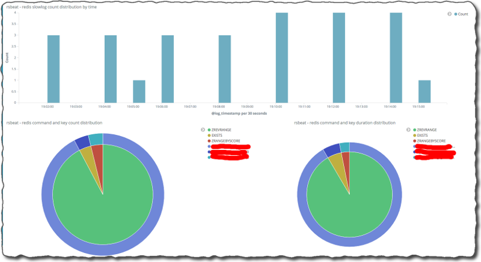
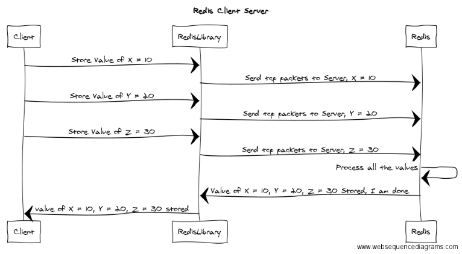

# Redis Watch Edition #69

> May 4th, 2017

## `# include "i.h"`

Hello,

This edition begs to begin with a laudable numbers joke, but I'm refrained from doing that. Instead, let us note how May Fourth is just a play on June Third and snicker at this ripoff of what is truly a glorious day. Snicker snicker.

May the force be with you,  
Itamar

## `int main(int argc, char **argv) {`

### [Redis 4.0 RC3 is out!](https://www.reddit.com/r/redis/comments/66vkli/redis_40_rc3_is_out/) (3.99998 minutes to read)

**[Salvatore Sanfilippo @antirez](https://twitter.com/antirez)** releases the third candidate (technically 4th?) for v4 is out with a boot-load of goodies ranging from features through fixes to improvements across the board. Barring stop-the-world issues and forces of nature, it looks a formal release isn't too far away. Two and a half notable observations about the RC's  impressive payload:

1. A substantial count of major changes
2. The <strike>force</strike> community is strong - happy May Fourth!
   1. More parties involved in fixing issues and contributing features
   2. Two of the biggest cloud providers' employees assist in squashing a family of OSS DB bugs (should that become a trend, **[Matt Asay @mjasay](https://twitter.com/mjasay)** will have to redo [Cloud convenience is killing the open source database](http://www.infoworld.com/article/3147864/cloud-computing/cloud-convenience-is-killing-the-open-source-database.html) via **[InfoWorld @infoworld](https://twitter.com/infoworld)**)

### OH [Salvatore Sanfilippo @antirez](https://twitter.com/antirez/status/857897070124044288)

> Redis would not be sustainable without the help received from the community and from the Redis Labs folks (and I would be mad…)

### [LMDB -- First version of Redis written in Tcl](https://gist.github.com/antirez/6ca04dd191bdb82aad9fb241013e88a8) `#Nerdgasm` <- Gelato all'interno

Look what **[Salvatore Sanfilippo @antirez](https://twitter.com/antirez)** had found in his email archives - the first version of what would eventually become it and several related [trivia facts](trivia-archive.md).

### [How We Built r/Place](https://redditblog.com/2017/04/13/how-we-built-rplace/) (~6:38 minutes to read) `#Patterns`

tl;dr from [`BITFIELD`'s motivations](https://redis.io/commands/bitfield#motivations) by **[Salvatore Sanfilippo @antirez](https://twitter.com/antirez/status/857897070124044288)**:

> Fun fact: Reddit's 2017 April fools' project r/place was built using the Redis BITFIELD command in order to take an in-memory representation of the collaborative canvas.

Discussion in /r/programming: [https://www.reddit.com/r/programming/comments/656z8t/how_we_built_rplace/](https://www.reddit.com/r/programming/comments/656z8t/how_we_built_rplace/)

Code repository: [reddit-plugin-place-opensource/reddit_place](https://github.com/reddit/reddit-plugin-place-opensource/tree/master/reddit_place)

All thanks for the best ever April Fools' project go to [Brian Simpson](https://www.reddit.com/user/bsimpson/), **[Matt Lee @madlymattlee](https://twitter.com/madlymattlee)**, **[Dan Ellis @I_am_Dan_Ellis](https://twitter.com/I_am_Dan_Ellis)** and the entire **[Reddit @reddit](https://twitter.com/reddit)** team.

### OH [Dan Ellis @I_am_Dan_Ellis](https://twitter.com/I_am_Dan_Ellis/status/852659133249503232)

> _It's very cool and was the perfect data structure for our use case.  Thanks for making it!_

### OH [Kevin O'Connor @gooeyblob](https://twitter.com/gooeyblob/status/852653277539835904)

> _Wouldn't have been possible without redis! Thank you!_

### [The new LFU mode](https://redis.io/topics/lru-cache#the-new-lfu-mode) `#RTFM` `#TIFU`

A new section has been added to the documentation about v4's new eviction policy - by **[Salvatore Sanfilippo @antirez](https://twitter.com/antirez)**.

*Note to self: verify that LFU is a politically correct.*

### [Microservices At The Heart of BBC iPlayer](https://31337.it/qcon-2017/#Microservices-At-The-Heart-of-BBC-iPlayer) (<1 minute to scroll)

**[Santoro Simon](https://31337.it/about/)** had attended **[QCon @QCon](https://twitter.com/QCon)** London 2017 and took notes of what looks like an educational user story . Of particular (personal) interest was [this session](https://qconlondon.com/london-2017/london-2017/speakers/cem-staveley.html) from Cem Staveley, but both video and presenter are untraceable to this watcher's eye.

### [An Alternative Approach to Rate Limiting](https://medium.com/figma-design/an-alternative-approach-to-rate-limiting-f8a06cf7c94c) (9 min read) `#Patterns`

**[Nikrad Mahdi @nmahdi](https://twitter.com/nmahdi)** reviews the design of the homegrown rate limiting system that's employed by **[Figma @figmadesign](https://twitter.com/figmadesign)** to protect against spam attacks. He provides a wonderfully graphic explanation of three approaches - token bucket, fixed window counters and sliding window log - in native Redis terms.

### [Connect to Redis Elasticache through an EC2 SSH Tunnel](https://userify.com/blog/howto-connect-redis-ec2-ssh-tunnel-elasticache/) `#howto` `#jailbreak`

Due to security reasons, AWS' Redis-as-a-Service is not accessible to public interfaces. While this lockdown prevents some attacks, it also makes it impossible to just connect to from, lets say, your laptop. **[Jamieson Becker @JamiesonBecker](https://twitter.com/JamiesonBecker)** of **[Userify @userify](https://twitter.com/userify)** shows how to  set up a tunnel to quickly and effectively work around that issue.

### [Redis Quickie: Scramble and unscramble your commands in Node.js](https://medium.com/@stockholmux/redis-quickie-scramble-and-unscramble-your-commands-in-node-js-1495a5549618) (3 min read)  `#NodeJS` `#BonusValue`

A security-oriented piece in the ever-growing series by **[Kyle @stockholmux](https://twitter.com/stockholmux)**, that shows how to use the `rename-command` configuration directive and call the renamed command from code.

*Bonus: whilst researching the this, Kyle also uncovered an issue ([#3978](https://github.com/antirez/redis/issues/3978)) in the cli.*

### OH [Arthur Belair @ArthurBelair](https://twitter.com/ArthurBelair/status/859810268079173632)

> @stockholmux your Node/Redis series is amazing! Thanks for the great content

### [Redis powered Microservices using Hydra](https://medium.com/@cjus/redis-powered-microservices-using-hydra-cc9b2898f56c) (3 min read) `#ELI5` `#NodeJS`

**[Carlos Justiniano @cjus](https://twitter.com/cjus)** provides few-but-well-worded paragraphs about **[Hydra Microservice @HydraNPM](https://twitter.com/HydraNPM)** - clear, effective and compelling.

*TODO: 1) learn Node.js 2) write a few microservices (how many are enough?) 3) profit!* 

### [How is the result of `KEYS *` sorted?](http://stackoverflow.com/questions/43652737/redis-how-is-the-result-of-keys-sorted/43655476#43655476) `#PHP` `#SOReadyToHelp` 

This.

The reply is absolute perfection - enjoy and upvote **[h0x91B](http://stackoverflow.com/users/1242684/h0x91b)**'s answer }:-)

### OH [TJ Miller @SIXLIV3](https://twitter.com/SIXLIV3/status/854370784927776768)

> The more I use Redis, the more I find uses for Redis

### [Monitoring Redis](http://www.mikeperham.com/2017/04/20/monitoring-redis/) `#howto`

**[Mike Perham @mperham](https://twitter.com/mperham)** had a productive month preparing for #RailsConf. Between describing [how to migrate Sidekiq from using namespaces to numbered databases](http://www.mikeperham.com/2017/04/10/migrating-from-redis-namespace/) to releasing [Sidekiq v5.0](http://www.mikeperham.com/2017/04/25/hello-sidekiq-5.0/) ('grats!), he also put together this handy reference about the basics of Redis monitoring. 

### [Yourdream/rsbeat](https://github.com/yourdream/rsbeat) `#foss` `#ElasticStack` `#golang`

Complete at least one of the extra credit tasks in the item above - this is a Beat that collects the Redis slowlog and a dashboard to match.

### [Red hot Redis powers Netcore’s billion-plus connects for SMS campaigns](https://blog.netcore.in/redis-powers-netcores-billion-plus-connects-sms-campaigns/) (4 minutes to read)

**[Anil Shukla @shuklaanil](https://twitter.com/shuklaanil)** tells how **[Netcore Solutions @NetcoreSolution](https://twitter.com/NetcoreSolution)** had moved from a single Redis instance to a sharded topology. While a little skimpy on details regarding how sharding was actually done, this still makes a short nice read.

### OH [Joshua Cohen @heyjoshua](https://twitter.com/heyjoshua/status/855985862928150528)

> Early on at Flickr, I once ran a flushall against a prod redis instance, not realizing a) it was prod and b) it dropped *all* dbs.

### [Using Redis as a session store in Go](http://mycodesmells.com/post/using-redis-as-sessions-store-in-go) & [Counting Stuff with Redis](http://mycodesmells.com/post/counting-stuff-with-redis) `#howto` `#golang` `#twofor`

It may be too early to tell, but by the looks of it appears that there's a new series author becoming. **[Paweł Słomka @pawel_slomka](https://twitter.com/pawel_slomka)** is a gopher, and provides two tutorials that I sniffed .

*Note: both are extremely satisfying, olfactory-wise, in my opinion*

### [Maintaining a Database of Reputation Data With Splunk](https://dzone.com/articles/adding-free-ip-reputation-feeds-to-splunk) `#howto` `#foss` `#python` 

If you're already using `#Splunk`, here's how you can add a reputation database (reputed as a necessary enrichment ingredient) with a little of open source software goodness from **[RST Cloud @rst_cloud](https://twitter.com/rst_cloud)**.

GitHub repository: [https://github.com/rstcloud/threatdb/](https://github.com/rstcloud/threatdb/)

### [Redis on Autopilot](https://www.joyent.com/blog/redis-on-autopilot) `#AutopilotPattern`

This introduces the [Autopilot Pattern](http://autopilotpattern.io/) for Redis (no cluster support... yet). By **[Jason Pincin @jasonpincin](https://twitter.com/jasonpincin)** of **[Joyent @joyent](https://twitter.com/joyent)**, along with the contributions of **[Dave Dunkin @ddunkin](https://twitter.com/ddunkin)** and **[Faithlife @Faithlife](https://twitter.com/Faithlife)**.

### [Write Fast Apps Using Async Python 3.6 and Redis](https://eng.paxos.com/write-fast-apps-using-async-python-3.6-and-redis) `#howto` `#foss` `#Python3`

With the Redis-backed (in-memory) db [subconscious](https://github.com/paxos-bankchain/subconscious)  by **[Michael Flaxman @mflaxman](https://twitter.com/mflaxman)** via **[Paxos @PaxosGlobal](https://twitter.com/PaxosGlobal)**.

*Note: smells like ORM*

### OH [Jono @iamjono](https://twitter.com/iamjono/status/859487431611076614)

> I have to say, Redis is the politest and most gentlemanly of all databases: “Redis is now ready to exit, bye bye…”

### [leonchen83/redis-replicator](https://github.com/leonchen83/redis-replicator) `#foss` `#Java`

While still new-ish, this looks promising in terms of functionality and robustness - a replication tool that supports slave synchronization, persistence files and the latest formats and versions. By **[leon.chen @chenbaoyi1](https://twitter.com/chenbaoyi1)**.

Discussion in /r/redis: [https://www.reddit.com/r/redis/comments/64qnt1/i_wrote_a_tool_which_implemented_redis/](https://www.reddit.com/r/redis/comments/64qnt1/i_wrote_a_tool_which_implemented_redis/)

### [Redis Pipeline Batching](http://taswar.zeytinsoft.com/redis-pipeline-batching/) `#howto` `#CSharp`

Three well-executed simple-n-clear diagrams by **[Taswar Bhatti @taswarbhatti](https://twitter.com/taswarbhatti)**, that make it hard to miss the points of using pipelining and batching (transactions). You can safely treat the code snippets as written in some pseudo language ;)

*Note to self: steal these for next training session!*

### [72squared/redpipe](https://github.com/72squared/redpipe) `#foss` `#Python`

My reaction to the project's promise - *"Making Redis pipelines easier to use in Python"* - was: pipelines work just fine, why change anything? But after reading [the (great!) docs](http://redpipe.readthedocs.io/en/latest/) about "a paradigm shift" to using "reusable blocks " and "duck-typing"... well, it makes perfect sense. Pythonistas should really check this one out.

*Bonus: both stand-alone and cluster modes are supported.*

### [Hangfire.Pro.Redis 2.1.0](https://www.hangfire.io/blog/2017/04/17/hangfire.pro.redis-2.1.0.html) `#oss` `#DotNET`

In it's latest update, this open-source-but-yet-commercial .NET client reels in support for the cluster and better connection resilience. Via **[Sergey Odinokov @odinserj](https://twitter.com/odinserj)** of **[Hangfire @hangfireio](https://twitter.com/hangfireio)**.

### [gabfl/redis-expire-least-used](https://github.com/gabfl/redis-expire-least-used) `#foss` `#Lua`

A proof of concept by **[Gabriel Bordeaux @gabrielbordeaux](https://twitter.com/gabrielbordeaux)** that essentially adds usage-based expiry on top of Redis' TTL.

That's a very cool pattern that can be quite useful, as the graph "proves" - someone could develop a Module (s! Modules! Modules!) for that to take it to the next level...

### OH [Phillip LeBlanc @leblancphill](https://twitter.com/leblancphill/status/851590104502095873)

> New redis slogan: Cache me outside, howbow dah?

## Modules! Modules! Modules!

### [Need for speed](https://www.youtube.com/watch?v=jOos6vIO7OE) (41:54 minutes to watch) `#bws17` `#Lua`

**[Elena Kolevska @elena_kolevska](https://twitter.com/elena_kolevska)** gave a great talk on getting more out of Redis. **[Boyan Yordanov @specter_bg](https://twitter.com/specter_bg)** [summarizes](https://medium.com/@boyanyordanov/bulgaria-web-summit-2017-recap-edf5cda7bbb5):

> Then Elena Kolevska came on stage and showed us how you can improve the performance of Redis, just by reducing the number of requests, using pipelines or Lua scripts. And if you are a really hardcore developer you can go to “warp ten” by writing an extension in C. An Easter egg in her talk was that it was actually a continuation of a talk she gave last year at the Bulgaria PHP conference, which I also had the pleasure to see.

### [background_keys.c](https://gist.github.com/antirez/c07a6fdbd408f260aff14ab6d2ab5024) <- the day that Hell froze `#API`

On the quest of pushing the modules API further and farther, **[Salvatore Sanfilippo @antirez](https://twitter.com/antirez)** has made blocking commands even more powerful with a thread-safe context that allows interaction with the core. Put differently, this gist shows how to implement `KEYS` using a non-blocking, client-blocking module command.

### [StackExchange.Redis and Redis 4.0 Modules](http://blog.marcgravell.com/2017/04/stackexchangeredis-and-redis-40-modules.html) (5 minutes to read) `#foss` `#CSharp`

Everything in life comes with a price, and you need to work hard to get anything done in this world. But not always, and never when it comes to my ever-favorite always-there so-ready-to-help superhero **[Marc Gravell @marcgravell](https://twitter.com/marcgravell)** of the **[Stack Exchange @StackExchange](https://twitter.com/StackExchange)**.

Come on DotNETters - make a change and shape how modules will be supported in The `#foss` client for `#DotNET`!

### OH [Marc Gravell @marcgravell](https://twitter.com/marcgravell/status/858458065405972481)

> Only way to be sure the SE.Redis "modules" extension API works is to write some... I may or may not have just ported JRediSearch to .NET :)

### [RedisLabsModules/RediSearch 0.15](https://github.com/RedisLabsModules/RediSearch/releases/tag/v0.15) `#foss` `#C`

The one-man-wonder **[Dvir Volk @dvirsky](https://twitter.com/dvirsky)**, with whom I proudly share a room and many opinions, keeps pouring absolute awesomeness into his uber-module. Here's a recap of what you've missed since last time:

* Queries turned to level 11:
  * Field modifiers for creating complex filtering on multiple fields
  * Allow selecting multiple fields
  * Optional terms and clauses
  * Match on prefix, (e.g. `Redis Watc*`)
  * Support for `NOT` queries
* Results are sortable by property
* Queries can have payloads (to be used by a custom scoring function)
* Support for dynamically loading extensions... let me repeat that: **Support for dynamically loading extensions!** Let that one sink in for a minute. Yes, that means the monster can haz its own modules.

### OH [Dvir Volk @dvirsky](https://twitter.com/dvirsky/status/856182155399102464)

> Yes, this is the first #redis module to have a module system of its own #inception

## The Future

### [Redis BoF at Austin OSCON](https://redislabs.com/blog/see-austin-oscon-2017/)

**When 1:** Monday, May 8th, 2017, 7:00 to 8:00 PM   
**When 2:** Wednesday, May 10th, 2017, 7:00 to 8:00 PM   
**Contact:** **[tague @tague](https://twitter.com/tague)**

### [Introduction to Redis and Python (The Austin Python Meetup)](https://www.meetup.com/austinpython/events/234490249/)

**When:** Thursday, May 10, 2017, 7:00 PM  
**Where:** **[Atlassian @Atlassian](https://twitter.com/Atlassian)**, 303 Colorado Street, Suite 1600, Austin, TX

### [Scaling with Redis for Caching and Background Jobs (Seattle Redis Meetup)](https://www.meetup.com/Seattle-Redis/events/239515220/)

**When:** Thursday, May 18, 2017, 5:30 PM to 7:30 PM  
**Where:** **[Napster @napster](https://twitter.com/napster)**, 701 5th Avenue, Suite 3100, Seattle, WA  
**What 1:** Scaling with Redis for Caching and Background Jobs  
**What 2:** TBD <- feel free to approach the organizers with suggestions

### [Redis Conf 2017](http://redisconf.com)

## Redis Labs

### [Docker and Redis Enterprise Pack - Developing Redis Applications on Windows, MacOS or Linux with Containers](https://redislabs.com/blog/docker-redis-enterprise-pack-developing-redis-applications-windows-macos-linux-containers/)

We are excited to announce the preview release of the new docker image for Redis Enterprise Pack.

### [Using Redis on Windows](https://dzone.com/articles/redis-on-windows-what-are-your-options)

Microsoft sponsored a project to port Redis onto Windows, but the project was recently discontinued according to Microsoft. What are your options now? Let Redis Labs VP of Product Management **[Cihan Biyikoglu @cihangirb](https://twitter.com/cihangirb)** tell you via **[DZone @DZone](https://twitter.com/DZone)**.

### [The Forrester Wave™: Database-as-a-Service, Q2 2017](https://redislabs.com/docs/forrester-wave-database-service-q2-2017/)

Redis Labs is ranked as top #4 database-as-a-service providers - fourth only to AWS, Microsoft and Oracle! - for its score in the current offering category, recognized for its ease of use, scale and high availability functionality.