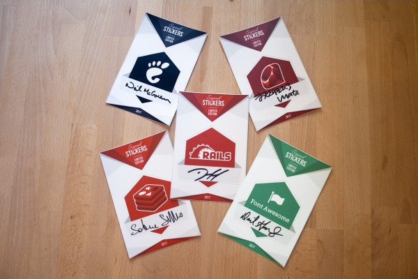
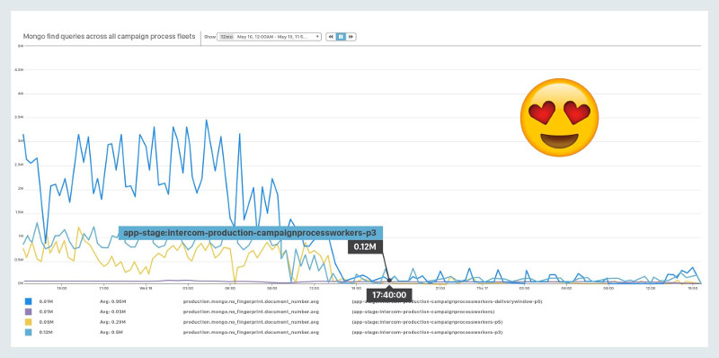
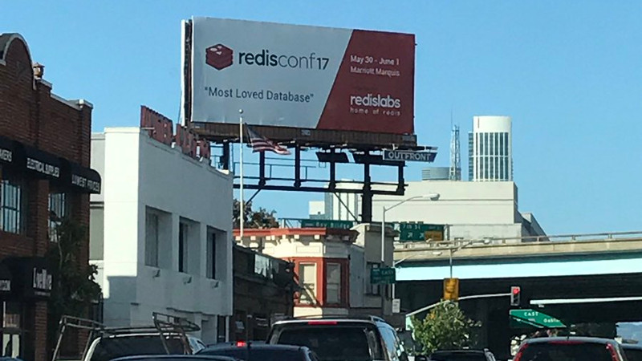

# Redis Watch Edition #70

> June 8th, 2017

## `# include "i.h"`

Hello friends.

The past few weeks have been a roller coaster of frenzy activity, with RedisConf 2017 taking front stage at the May's end. Totally unrelated to that, I was interviewed by **[OpenChannel @OpenChannelTech](https://twitter.com/OpenChannelTech)**'s Michael Kovacs about [what I've learned being a part of the Redis community](https://devkit.io/blog/what-ive-learned-with-itamar-haber/) (note to self: do **not**  give phone interviews on weekend nights while nursing a single malt).

Before getting started, I want to direct your attention to a beautiful initiative from **[unixstickers @unixstickers](https://twitter.com/unixstickers)**. Quoting the post at [/r/redis](/r/redis):

> After months of intense work, we're proud to announce our new initiative to support FOSS with donations.
>
> We asked 5 FOSS idols to sign a handful of limited edition stickers, which are available until sold out. Each of the signers appointed a specific foundation or initiative that will benefit from the proceeds raised through the initiative.
>
> Here are the 5 FOSS idols, who we couldn't be more thankful with:
>
> - Dave Gandy, founder of Font Awesome (all donations go to New Story Charity [newstorycharity.org](http://newstorycharity.org))
> - Yukihiro Matzumoto aka Matz, chief designer of the Ruby programming (all donations go to [rubycentral.org](http://rubycentral.org))
> - Salvatore Sanfilippo aka Antirez, creator of Redis (all donations go to Museo dell'Informatica Funzionante [museo.freaknet.org](http://museo.freaknet.org))
> - David Heinemeier Hansson aka DHH, creator of Ruby on Rails (all donations go to the Electronic Frontier Foundation [www.eff.org](http://www.eff.org/))
> - Neil McGovern, Executive Director at the GNOME Foundation (all donations go to the GNOME Foundation [www.gnome.org/foundation](http://www.gnome.org/foundation))
>
> Show your love by sharing the initiative and get the limited edition signed stickers here: [https://www.unixstickers.com/signed-stickers](https://www.unixstickers.com/signed-stickers)

[](https://www.unixstickers.com/signed-stickers)

Cheers,
Itamar

## `int main(int argc, char **argv) {`

### [Redis 3.2.9 is out](https://raw.githubusercontent.com/antirez/redis/3.2/00-RELEASENOTES) `#v4IsComing`

A minor release with a few bug fixes and a **low** update urgency. Expect a lot more from **[Salvatore Sanfilippo @antirez](https://twitter.com/antirez)** in the near future...

### [RedisLabs/triemap](https://github.com/RedisLabs/triemap) `#foss` `#BSD2Clause` `#C`

Is a C implementation of a compressed [trie](https://en.wikipedia.org/wiki/Trie) lookup map. **[Dvir Volk @dvirsky](https://twitter.com/dvirsky)** made it to power some of the awesomeness (e.g. auto-complete) in [RediSearch](http://redisearch.io/).

### [antirez/rax](https://github.com/antirez/rax) `#foss` `#BSD2Clause` `#c`

Is a [radix tree](https://en.wikipedia.org/wiki/Radix_tree) implementation in ANSI C by **[Salvatore Sanfilippo @antirez](https://twitter.com/antirez)**. This cool data structure was suggested as a fix to a regression in the cluster's performance and will be used for that in v4. However, it will be put to more extensive use in future versions of Redis, improving performance and reducing the overheads and complexity of internal data structures such as the hash dictionary (bonus: looks like we're gonna get efficient prefix searches on key names :)).

### OH [Github Trending @TrendingGithub](https://twitter.com/TrendingGithub/status/861188257610158080)

> antirez / redis-doc: Redis documentation source code for markdown and metadata files, conversion scripts, and... https://github.com/antirez/redis-doc

LOL - Redis is so popular that even its docs are trending on GitHub, ty mit <3 **[Andy Grunwald @andygrunwald](https://twitter.com/andygrunwald)**

### [Making a Geohash of it](https://medium.com/bbc-design-engineering/making-a-geohash-of-it-4927d1f18a28) (9 min read)

In an article that is actually about education through gamification, **[Adam Roberts @ad_roberts](https://twitter.com/ad_roberts)** from the **[BBC @BBC](https://twitter.com/BBC)** maps questions to their respective answers and provides the directions for the quest of making a responsive, terrific-looking map of about a gazillion experiments across the UK.

### [View Counting at Reddit](https://redditblog.com/2017/05/24/view-counting-at-reddit/) (4 minutes to read)

**[Krishnan Chandra](https://www.reddit.com/user/shrink_and_an_arch)**, a senior software engineer at **[Reddit @reddit](https://twitter.com/reddit)**, tells how Redis' HyperLogLog is used alongside Cassandra in a Kafka-esque pipeline to count views at (Reddit's) scale.

### [Efficient analytics with Redis Bitmaps](https://www.youtube.com/watch?v=a-BtWlU55kk) (3:19 minutes to watch)

Bitmaps are well-explored territory, but this video manages to get across the main points and build just enough interest to encourage you to go on an auto-didactic journey - from **[Ivan Zarea @ivanzarea](https://twitter.com/ivanzarea)**.

### [Counting Stuff in Hashes](http://mycodesmells.com/post/counting-stuff-in-hashes) `#howto` `#golang`

Another aromatic serving from **[Paweł Słomka @pawel_slomka](https://twitter.com/pawel_slomka)**, who debuted in this newsletter's previous edition. This time, an introduction to using Redis Hashes to count stuff.

### [activityclub/pointspaced](https://github.com/activityclub/pointspaced) `#foss` `#MIT` `#golang` `#Lua`

Is a server that collects and aggregates data into a very neat data structure made up of collections of (Redis) hashes. Despite being written in Go, the heavy lifting of doing the writes is contained in a Lua script that can be easily called from any language (caution: see [issue #1](https://github.com/activityclub/pointspaced/issues/1)). Via the **[activity.club @activityclubapp](https://twitter.com/activityclubapp)** team.

### OH **[Daniel Leite @dleitee](https://twitter.com/dleitee)** via **[Cheesecake Labs @CheesecakeLabs](https://twitter.com/CheesecakeLabs)** ([source](https://medium.com/cheesecake-labs/a-simple-chat-architecture-for-your-mvp-7a903c957096))

> Thinking about real-time... For Pub/Sub, we chose Redis — an open source (BSD licensed), in-memory data structure store, used as a database, cache and message broker — as our team was very familiar with it. This tool has an utmost importance for the operation of our new architecture, allowing messages to the almost instantaneously published without harming our web service performance.

### [Building The Buffer Links Service](https://overflow.buffer.com/2016/12/05/building-buffer-links-service/) (6 minutes to read)

Posts about Redis are especially beneficial when they describe why/how the decision to use it was   **[Harrison Harnisch @hjharnis](https://twitter.com/hjharnis)** via **[Buffer @buffer](https://twitter.com/buffer)**

### [How to Use Elasticsearch, Logstash, and Kibana to Manage Redis Logs](https://qbox.io/blog/redis-logs-elasticsearch-logstash-kibana) `#howto` `#devops`

The title sums it up nicely, and the article appears to have all the required details to get you from 0 to 11. By **[Adam Vanderbush @CommandrAvander](https://twitter.com/CommandrAvander)** of **[Qbox.io @qboxio](https://twitter.com/qboxio)**.

*Note: I wonder if Elasticsearch could be replaced by, lets say, RediSearch?*

### [Remote Redis: Spiped vs Stunnel](https://itschr.is/remote-redis-spiped-vs-stunnel/) (4 minutes to read)

**[Chris Tanner](https://www.instagram.com/itschr.is/)** takes lovely photos, but in between he also tested the performance of the two approaches for securing the communication to a remote Redis server. Looks like we have a winner (spoiler: stunnel).

*Note: if anyone knows Chris' Twitter handle so he can be credited please lmk (I don't have an Instagram account)*

### [RedisLabs/sentinel_tunnel](https://github.com/RedisLabs/sentinel_tunnel) `#foss` `#BSD2Clause` `#golang`

Is a local proxy server for discovering and connecting to Redis via Sentinel. The idea is simple but extremely effective - the proxy does all the heavy lifting of connecting to the current Redis master by chatting with the configured Sentinel deployment, and provides a local port to which a client can connect. The client doesn't know anything about the underlaying complexities and is oblivious to failures without requiring any special configuration or code changes.

By **[Meir Shpilraien @Meir_Shpilraien](https://twitter.com/Meir_Shpilraien)** of **[Redis Labs @RedisLabs](https://twitter.com/RedisLabs)**.

### OH [Coding with Jesse @JesseSkinner](https://twitter.com/JesseSkinner/status/861770418931331072)

> It can be really helpful to have the MONITOR command show you a live log of all the #Redis calls you're making while you're programming.

*Note: word.*

### [Rate Limiting Using Redis in Python](http://bobintornado.github.io/development/2017/05/15/Rate-Limiting-Using-Redis-in-Python.html) `#howto` `#Python`

**[Bob Cao @bobintornado](https://twitter.com/bobintornado)** scratches my itch for rate limiters and makes an opening that I find irresistible to not quoting:

> Redis is an awesome piece of software, and I am hugely biased towards it. It’s very versatile and powerful, could fulfill a wide range of use cases, such as implementing a rate limiter.

### [A Redis 4 Docker Image Proposal](https://medium.com/@andrenit/a-redis-4-docker-image-proposal-4112990eb5d2) `#howto` `#Docker`

**[André Fernandes @andrenit](https://twitter.com/andrenit)** presents his proposal for a v4 image, leveraging Docker 17.05's multi-stage builds to slap a server+module image together.  If anyone reading this is a Docker guru it would be good to get more feedback on that. Personally, he got me at ReJSON ;)

### [Redis Performance Triage Handook](https://aadrake.com/posts/2017-05-15-redis-performance-triage-handbook.html) `#protip`

**[aadrsake @aadrake](https://twitter.com/aadrake)** collected 10 performance-focused advices for Redis users, each invaluable by its own right, including:

1. No `KEYS` command. Ever.
2. Use variadic commands
3. Pipeline your commands

... and 7 more.

### [zdharma/zredis](https://github.com/zdharma/zredis) `#foss` `#GPL3` `#Zsh`

Is a Redis database mapping for Zsh by the **[Zdharma Initiative @ZdharmaI](https://twitter.com/ZdharmaI)**, for example:

```shell
% redis-cli -n 3 hmset HASHSET field1 value1 fld2 val2
% ztie -d db/redis -f "127.0.0.1/3/HASHSET" hset
% echo ${(kv)hset}
field1 value1 fld2 val2
% echo ${(k)hset}
field1 fld2
% echo ${(v)hset}
value1 val2
% redis-cli -n 3 rpush LIST empty
% ztie -d db/redis -f "127.0.0.1/3/LIST" list
% echo ${(t)list}
array-special
% list=( ${(k)hset} )
% echo $list
field1 fld2
% redis-cli -n 3 lrange LIST 0 -1
1) "field1"
2) "fld2"
% for (( i=1; i <= 2000; i ++ )); do; hset[$i]=$i; done
% echo ${#hset}
2002
```

### [Fastest Redis configuration for Django](https://www.peterbe.com/plog/fastest-redis-optimization-for-django) `#howto` `#Python` `#Django`

In the spirit of "let someone else test this", that someone is **[Peter Bengtsson @peterbe](https://twitter.com/peterbe)** when it comes to identifying the most performant cache configuration for his Django app. In his [previous post](https://www.peterbe.com/plog/fastest-cache-backend-possible-for-django) Peter had already demonstrated the Redis is better suited for his needs (compared to Memcached), so in this one he pits different serializers and compressors against each other.

### [vy/log4j2-redis-appender](https://github.com/vy/log4j2-redis-appender) `#foss` `#GPL3` `#Java`

Is a Log4j 2 Appender for Redis by **[Volkan Yazıcı @yazicivo.](https://twitter.com/yazicivo)**

### OH **[Paul Magrath @PaulMagrath](https://twitter.com/PaulMagrath)** via **[Intercom @intercom](https://twitter.com/intercom)** ([source](https://blog.intercom.com/what-do-you-do-when-a-feature-grows-faster-than-expected/))

> ... Armed with this knowledge, we introduced a Redis cache for our Mongo database, a huge performance and availability win ... We quickly saw a massive decrease in the load on the Mongo database. In the left of the below graph, you’ll see the amount of queries before adding the Redis cache. The right hand side shows after adding the Redis cache, decreasing the load to almost nothing.

[](https://blog.intercom.com/what-do-you-do-when-a-feature-grows-faster-than-expected/)

## Modules! Modules! Modules!

### [Redis Modules page at redis.io](https://redis.io/modules)

The project's website has been updated with a list of open-source Redis modules. To add yours, make a PR to the *"modules.json"* file in the [redis-doc repository](https://github.com/antirez/redis-doc/blob/master/modules.json).

### [Redis thread safe contexts](https://www.youtube.com/watch?v=tbdbSSJio8w) (14:38 minutes to watch) `#howto` `#C`

Modules aren't just about bringing new functionality into Redis - they are also changing how Redis works in the most fundamental level. In this webcast, Redis' creator **[Salvatore Sanfilippo @antirez](https://twitter.com/antirez)** explains the newest feature of the API, which basically lets the module's threads access the server safely. Yep, you read that right, modules can be truly threaded now.

### [erans/redissnowflake:](https://github.com/erans/redissnowflake) `#foss` `#MIT` `#C`

Is a (Twitter) [Snowflake-based](https://github.com/twitter/snowflake/tree/snowflake-2010) ID generator wrapper implemented as a Redis module by **[Eran Sandler @erans](https://twitter.com/erans)**.

### [aviggiano/redis-roaring](https://github.com/aviggiano/redis-roaring) `#foss` `#MIT` `#C`

Is a wrapper module for the Roaring Bitmaps (compressed bitmaps which tend to outperform conventional compressed bitmaps) [CRoaring library](https://github.com/RoaringBitmap/CRoaring) by **[Antônio Guilherme @toonhao](https://twitter.com/toonhao)**.

### [Redis Search](https://dmitrypol.github.io/redis/2017/05/13/redis-search.html) `#howto ` `#Ruby`

**[dmitrypol @dmitrypol](https://twitter.com/dmitrypol)** with a 7-minute read showing how to use RediSearch with the Ohm library.

### [vruizext/redisearch-rb](https://github.com/vruizext/redisearch-rb) `#foss` `#MIT` `#Ruby`

Is a simple Ruby client for RediSearch module thanks to **[Victor Ruiz @bik_tor](https://twitter.com/bik_tor)**.

### [RedisLabsModules/RediSearch 0.17.1](https://github.com/RedisLabsModules/RediSearch/releases/tag/v0.17.1) `#foss` `#AGPL` `#C`

It just keeps getting better:

- In-Query Numeric Predicates, e.g. @price:[100 200]
- Complete parser and tokenizer rewrites
- BugFixes and issue_squashing
- New API Command: `FT.EXPLAIN`


### [RedisLabs/rejson-py v0.2 "hootnot"](https://github.com/RedisLabs/rejson-py/releases/tag/0.2.0) `#foss` `#BSD2Clause` `#Python`

Adds testing, coverage and support for Python 3 thanks to **[Feite Brekeveld @feite_brekeveld](https://twitter.com/feite_brekeveld)**.

## RedisConf17 - the aftermath

As the team is busily making everything available online, here are a few tastes of what it was all about. Stay tuned for a massive dumps of content soon.

* [RedisConf 2017 Recap](https://medium.com/@stockholmux/redisconf-2017-recap-day-1-baf8110e81f3) from **[Kyle @stockholmux](https://twitter.com/stockholmux)** <- part #2 pending
* The deck **[Daniel Hochman @danielhochman](https://twitter.com/danielhochman)** used in his talk [Geospatial Indexing at Scale: The 15 Million QPS Redis Architecture Powering Lyft](https://www.slideshare.net/DanielHochman/geospatial-indexing-at-scale-the-15-million-qps-redis-architecture-powering-lyft) (26 slides)
* All (most?) decks can be found at the Redis Labs SlideShare account: [https://www.slideshare.net/RedisLabs/presentations](https://www.slideshare.net/RedisLabs/presentations)
* The repo that **[Kelsey Hightower @kelseyhightower](https://twitter.com/kelseyhightower)** used for his keynote's amazing demo: [kelseyhightower/redis-enterprise-on-kubernetes](https://github.com/kelseyhightower/redis-enterprise-on-kubernetes). Note: once the videos are online, be sure to watch everything up until the part where Kelsey says: "And with that I want to end the presentation, thank you" - every second is golden :)

I'd also like to personally thank and mention all of our esteemed speakers (apologies in advance for any omissions): **Irfan Ahmad**, **[Rahul Babbar @rahulone](https://twitter.com/rahulone)**, **Brad Brech**  **[Nenad Bogojevic @NenadBo](https://twitter.com/NenadBo)**, **[Chuck Calio @chuckcalio](https://twitter.com/chuckcalio)**, **[Kyle Davis @stockholmux](https://twitter.com/stockholmux)**, **[Salil Deshpande @salil](https://twitter.com/salil)**, **[Daniel Ellis @I_am_Dan_Ellis](https://twitter.com/I_am_Dan_Ellis)**, **[Erol Erturk @er0l](https://twitter.com/er0l)**, **[Stefano Fratini @fratuz610](https://twitter.com/fratuz610)**, **[Robert Gay @roblg](https://twitter.com/roblg)**, **[Lou Harwood @lou_harwood](https://twitter.com/lou_harwood)**, **[Joel Hensley @fusball](https://twitter.com/fusball)**, **[Matthew Hicks @mkigikm](https://twitter.com/mkigikm)**, **[Kelsey Hightower @kelseyhightower](https://twitter.com/kelseyhightower)**, **[Daniel Hochman @danielhochman](https://twitter.com/danielhochman)**, **[Kevin Hoffman @KevinHoffman](https://twitter.com/KevinHoffman)**, **[Thomas Hunter II @tlhunter](https://twitter.com/tlhunter)**, **[Jon Hyman @jon_hyman](https://twitter.com/jon_hyman)**, **Brian Ip**, **[Jay Johnson @jayphjohnson](https://twitter.com/jayphjohnson)**, **[Ted Knudsen @ultrated](https://twitter.com/ultrated)**, **Nikita Koksharov**, **[Michael Labib @MichaelSLabib](https://twitter.com/MichaelSLabib)**, **[Cedric Lamoriniere @CedLamo](https://twitter.com/CedLamo)**, **John Loehrer**, **[Charity Majors @mipsytipsy](https://twitter.com/mipsytipsy)**, **[Joshua McKenty @jmckenty](https://twitter.com/jmckenty)**, **[Seandon Mooy @erulabs](https://twitter.com/erulabs)**, **[Jim Nelson @\_jimnelson\_](https://twitter.com/_jimnelson_)**, **[Philip Norman @philipnrmn](https://twitter.com/philipnrmn)**, **[Frank Ober @fxober](https://twitter.com/fxober)**, **[Ioannis Papapanagiotou @ipapapa](https://twitter.com/ipapapa)**, **[Pat Patterson @metadaddy](https://twitter.com/metadaddy)**, **[Sean Perkins @seanperkins](https://twitter.com/seanperkins)**, **Peter Phillips**, **[Aaron Pollack @the_lolpack](https://twitter.com/the_lolpack)**, **[Dmitry Polyakovsky @dmitrypol](https://twitter.com/dmitrypol)**, **Hari Ramamurthy**, **[Rashmi Ramesh @rashmi_ur](https://twitter.com/rashmi_ur)**, **[Sam Ramji @sramji](https://twitter.com/sramji)**, **[Venkatachalam Rangasamy @topideafactory](https://twitter.com/topideafactory)**, **[Chris Richardson @crichardson](https://twitter.com/crichardson)**, **[Jesus Ruiz @jruiztwi](https://twitter.com/jruiztwi)**, **[Madhu Therani @MadhuTherani](https://twitter.com/MadhuTherani)**, **Jim Vogt**, **[Reynold Xin @rxin](https://twitter.com/rxin)**, **[Cihan Biyikoglu @cihangirb](https://twitter.com/cihangirb)**, **[Leena Joshi @leena_joshi2015](https://twitter.com/leena_joshi2015)**, **Uri Shachar**, **[Guy Lubovitch @dragnot](https://twitter.com/dragnot)**, **[Elad Ash @AshElad](https://twitter.com/AshElad)**, **[Shay Nativ @shaynativ](https://twitter.com/shaynativ)**, **[Itamar Haber @itamarhaber](https://twitter.com/itamarhaber)**, **[Yiftach  Shoolman @Yiftachsh](https://twitter.com/Yiftachsh)**, **[Ofer  Bengal @oferbengal](https://twitter.com/oferbengal)** and **[Salvatore Sanfilipo @antirez](https://twitter.com/antirez)**.

On the lighter side, thank yous are also in order to **[The Spazmatics @SPAZMATICS](https://twitter.com/SPAZMATICS)**,  as well as to Thomas Middleditch [who deleted his Twitter account](https://www.reddit.com/r/SiliconValleyHBO/comments/67wk76/has_thomas_middleditch_deleted_his_twitter/) and plays in a character in some TV show. He was actually pretty okay on stage, although I definitely stole the show ;)

A special thanks goes to the rest of team from **[Redis Labs @RedisLabs](https://twitter.com/RedisLabs)** who made this a once-in-a-lifetime-event happen, including: **[Tague Griffith @tague](https://twitter.com/tague)**, **[Kirk Kirkconnell @rladmin](https://twitter.com/rladmin)**, **[Gabe Stanek @gastanek](https://twitter.com/gastanek)**, **[François Cerbelle @fcerbelle](https://twitter.com/fcerbelle)**, **[Adi Foulger @redismonkey](https://twitter.com/redismonkey)**, **[Rod Hamlin @rodhamlin](https://twitter.com/rodhamlin)**, **[Cassie Zimmerman @cassandrazimm](https://twitter.com/cassandrazimm)**, **[Jason Forget @Jasonaforget](https://twitter.com/Jasonaforget)**, **[Regev (Reggie) Yativ @regevyativ](https://twitter.com/regevyativ)**, **[Jeannie Chong @JeannieChong1](https://twitter.com/JeannieChong1)**, **[Sukhy Budwal @BudwalSukhy](https://twitter.com/BudwalSukhy)**, **[Devin Ramga @devinramga](https://twitter.com/devinramga)**, **[David Maitland @DCMaitland](https://twitter.com/DCMaitland)**, **[Mike McCrady @MikeMcCrady2](https://twitter.com/MikeMcCrady2)**, **[Roshan Kumar @RoshanKumar](https://twitter.com/RoshanKumar)**, **[Rik Walters @rikwalters](https://twitter.com/rikwalters)**, **[Saman Moayeri @MoayeriSaman](https://twitter.com/MoayeriSaman)**, **[Sharon Thompson @Square1Rolls](https://twitter.com/Square1Rolls)**, **[Manish Gupta @mgupta_sv](https://twitter.com/mgupta_sv)** and **[Aviad Abutbul @AviadAb](https://twitter.com/AviadAb)**.

Additional obligatory but grateful thanks are due to the event's gracious sponsors: **[Amazon Web Services @awscloud](https://twitter.com/awscloud)**, **[Google @Google](https://twitter.com/Google)**, **[Pivotal @pivotal](https://twitter.com/pivotal)**, **[Stack Overflow @StackOverflow](https://twitter.com/StackOverflow)**, **[Sticker Mule @stickermule](https://twitter.com/stickermule)**, **[Intel @intel](https://twitter.com/intel)**, **[Mesosphere @mesosphere](https://twitter.com/mesosphere)**, **[Zettaset @Zettaset](https://twitter.com/Zettaset)** and **[IBM @IBM](https://twitter.com/IBM)**.

Last, but not least, the real thanks goes to everyone who attended the conference - you're the reason for this conference and I hope to meet all of you next year at Redis Conf 2018.

### OH [benarent @benarent](https://twitter.com/benarent/status/863616636489572353)

> Crazy and cool that 5 years after the first @RedisConf it has a billboard in Soma. It was a hard time finding speakers for RedisConf #2



## 0ther b1ts

### [Optimizing Memcached Efficiency](https://engineering.quora.com/Optimizing-Memcached-Efficiency)

If memcached is your thing, this could be useful - by **[Siyuan Fu @fusiyuan2010](https://twitter.com/fusiyuan2010)** via **[Quora @Quora](https://twitter.com/Quora)**.

### [A Comparison of Advanced, Modern Cloud Databases](https://brandur.org/cloud-databases)

An informal yet informative study and comparison between Amazon Aurora, CitusDB, CockroachDB, Google Spanner, Microsoft Cosmos, MongoDB & Postgress from **[Brandur @brandur](https://twitter.com/brandur)**.

*Note: we missed you at the conf.*

## The Future

### [After Hours with Redis Labs UK](https://www.eventbrite.com/e/after-hours-with-redis-labs-uk-tickets-35087649103)

**When:** June 14, 2017 6PM-9PM
**Where:** CodeNode, 10 South Place, London
**What #1:** Using Redis as a Data Grid by **[Rui Gu @Redisson_RuiGu](https://twitter.com/Redisson_RuiGu)**
**What #2:** Machine Learning with Redis and Redis-ML by **[Tague Griffith @tague](https://twitter.com/tague)**

## Redis Labs

### [Redis<sup>e</sup> Pack v4.5.0 Release](https://redislabs.com/blog/redis-enterprise-pack-v4-5-0-release/)

We are very excited to announce the release of Redis<sup>e</sup> Pack 4.5.0. Along with many quality improvements and overall performance enhancements, this release ushers in two major capabilities;

- Redise Flash (RF) version 2 is now generally available for use in production.
- Simpler IP Based Connection Management with Discovery Service using  the Redis Sentinel API.

### [Redis Cloud Private](https://redislabs.com/blog/redis-cloud-private)

We are very excited to announce the preview release of the new simplified Redis<sup>e</sup> Cloud Private (RCP) managed DBaaS.

Redis<sup>e</sup> Cloud Private delivers a fully managed, cost effective, stable high performance Redis databases in dedicated clusters within your cloud account, using your own instances, inside your VPC, with the option to run Redis databases on RAM or RAM+Flash (Redise Flash)  as an extension of memory, using High IOPS NVMe-based SSD instances.

### [We Are HIRING](https://www.comeet.co/jobs/redislabs/40.009?coref=1.10.r85_00B&t=1496577242885)

We're looking for the right women and men to join our team as architects, software engineers, automation developers, technical support engineers, devops, sales managers and recruitment experts. Check our open positions out and refer your friends!

[](https://www.comeet.co/jobs/redislabs/40.009?coref=1.10.r85_00B&t=1496577242885)

